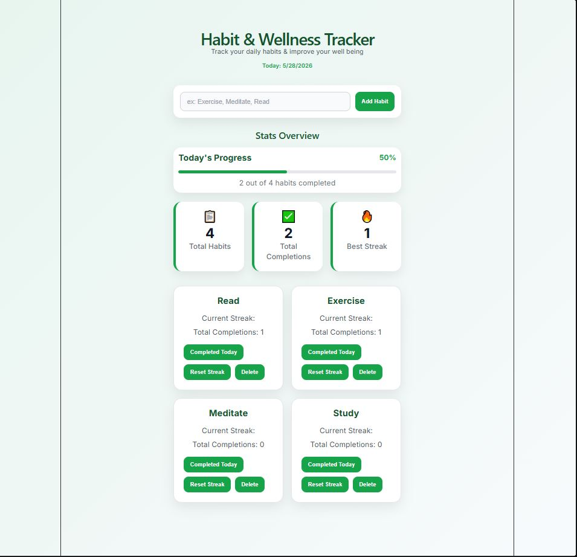
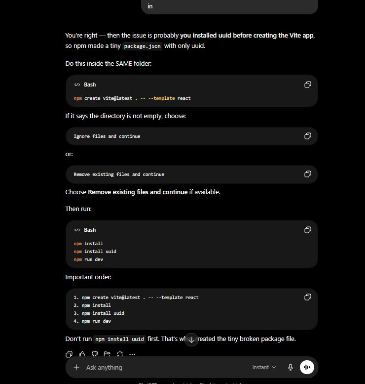

# Habit & Wellness Tracker



## Project Summary

Habit & Wellness Tracker is a React application that helps users build positive habits and monitor their daily progress. Users can add habits, track streaks, record completions, view statistics, and monitor overall progress through a simple and user-friendly interface.

The goal of this project was to apply core React concepts including components, state management, props, event handling, and dynamic rendering while building a complete front-end application.

---

## Features

* Add new habits
* Prevent empty habit submissions
* Track habit streaks
* Record habit completions
* Reset streaks
* Delete habits
* View habit statistics
* View progress percentage with a progress bar
* Save habit data using localStorage
* Responsive layout for smaller screens

---

## Technologies Used

* React
* JavaScript
* CSS
* Vite
* UUID
* Local Storage

---

## Installation

1. Clone the repository:

```bash
git clone <repository-url>
```

2. Navigate to the project folder:

```bash
cd HabitTracker
```

3. Install dependencies:

```bash
npm install
```

4. Start the development server:

```bash
npm run dev
```

5. Open the local host URL provided by Vite.

---

## Dependencies

Required packages:

```bash
npm install
npm install uuid
```

---
## AI Screenshots
Screen shot 1: Reset Streak Debugging

AI helped diagnose and resolve a resetStreak is not defined error that caused the application to render a blank page. The issue was traced to a missing function definition in App.jsx.

Screen shot 2: Habit Creation/UUID Debugging


AI assisted with debugging habit creation by using console logs to verify form submissions and habit object creation. This process helped identify and resolve issues related to UUID generation and habit creation functionality.

Screenshot 3: Project Setup and UUID Installation

AI assisted with troubleshooting project setup issues during the initial stages of development. An error occurred because the UUID package was installed before the React Vite application was properly created, resulting in an incomplete project configuration. AI helped identify the correct installation order and guided the setup process so development could continue successfully.


## AI Prompting and Learning

AI was used throughout development to assist with:

- Project planning
- React component organization
- Debugging application errors
- Styling and layout improvements
- Feature implementation including progress tracking and localStorage persistence

All code was reviewed, tested, and implemented as part of the development process.

### Planning

* Breaking the application into reusable React components.
* Designing the application layout and structure.

### Debugging

* Resolving issues with component rendering.
* Troubleshooting uuid imports.
* Fixing form submission issues.
* Debugging React state updates and localStorage integration.

### Styling

* Improving layout organization.
* Creating habit card designs.
* Building the statistics dashboard.
* Creating the progress bar.

### Feature Development

* Implementing streak tracking.
* Implementing progress calculations.
* Adding localStorage persistence.

---

## Testing

The following features were manually tested:

* Add habit functionality
* Empty habit validation
* Habit completion updates
* Streak tracking
* Reset streak functionality
* Delete habit functionality
* Statistics updates
* Progress bar updates
* LocalStorage persistence after page refresh

---

## Future Improvements

Possible future enhancements include:

* Habit categories
* Daily and weekly habit frequencies
* Dark mode
* Additional statistics
* Calendar-based habit tracking
* User accounts and cloud storage

---

## Author

Created as a React Capstone Project for bootcamp coursework.
